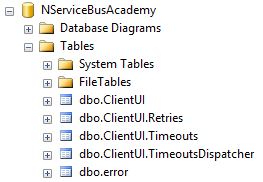

In the next 10 minutes, you will learn how to set up a new development machine for NServiceBus and create your very first messaging endpoint.


## What do I need to get started?

NServiceBus has very few prerequisites. It's very easy to get started.

Although [NServiceBus only requires .NET Framework 4.5.2](/nservicebus/operations/dotnet-framework-version-requirements.md), this course uses Visual Studio 2015 and .NET Framework 4.6.1, which includes some useful async-related APIs.

NServiceBus needs queuing infrastructure (a [transport](/nservicebus/transports/)) to move messages around. For this course we'll just use the [SQL Server Transport](/nservicebus/sqlserver/) since you probably already have access to a SQL database anyway. If not, you can download and install [SQL Server Express](http://downloadsqlserverexpress.com/) on your local machine.

On your database server, create a database named **NServiceBusAcademy**, which we'll use throughout the exercises.


## Exercise

Let's build something simple to give NServiceBus a try.


### Create a solution

First, let's create a basic solution and include the dependencies we need.

 1. In Visual Studio, create a new project and select the **Console Application** project type.
 1. Set the project name to **ClientUI**.
 1. Set the solution name to **RetailDemo**.

Next, we need to add the NServiceBus NuGet package as a dependency. From the [NuGet Package Manager Console](https://docs.nuget.org/ndocs/tools/package-manager-console), type the following:

```no-highlight
Install-Package NServiceBus -ProjectName ClientUI
```

This adds a reference to the NServiceBus.Core assembly to the project. Next we'll add a reference to the package for the SQL Server Transport. Type the following into the same package manager console:

```no-highlight
Install-Package NServiceBus.SqlServer -ProjectName ClientUI
```

With the proper dependencies in place, we're ready to start writing code.


### Configure an endpoint

Now we're ready to create a [**messaging endpoint**](/nservicebus/endpoints/). A messaging endpoint (or just **endpoint**) is a logical component that's capable of sending and receiving messages. An endpoint is hosted within a process, which in this case is a simple console application, but could be a web application or other .NET process.

Because of the current limitations of console applications, we need to add some boilerplate code to be able to use the `async`/`await` keywords.

In the **Program.cs** file, modify the code to look like the following:

snippet:EmptyProgram

Add the following code to your program first and then let's analyze the importance of each line.

Add this code to your AsyncMain method:

snippet:AsyncMain

Now, let's go line-by-line and find out exactly what each step is doing.


#### Console Title

snippet:ConsoleTitle

When running multiple console apps in the same solution, giving each a name makes them easier to identify. This console app's title uses `ClientUI`. In later lessons, we'll expand this solution to host several more.


#### EndpointConfiguration

snippet:EndpointName

The `EndpointConfiguration` class is where we define all the settings that determine how our endpoint will operate. The single string parameter `ClientUI` is the [**endpoint name**](/nservicebus/endpoints/specify-endpoint-name.md), which serves as the logical identity for our endpoint, and forms a naming convention by which other things will derive their names, such as the **input queue** where the endpoint will listen for messages to process.


#### Transport

snippet:Transport

This setting defines the [**transport**](/nservicebus/transports/) that NServiceBus will use to send and receive messages. We are using the `SqlServerTransport` from the **NServiceBus.SqlServer** NuGet package as it only has a dependency on SQL Server. Other transports require different NuGet packages.

snippet:ConnectionString

This setting allows the transport to connect to our SQL Server instance. Note that the connection string shown assumes the use of SQL Server Express. You may need to change the connection string as appropriate to connect to your SQL Server instance.


#### Serializer

snippet:Serializer

When sending messages, an endpoint needs to serialize message objects to a stream, and then deserialize the stream back to a message object on the receiving end. The choice of [**serializer**](/nservicebus/serialization/) governs what format that will take. Each endpoint in a system needs to use the same serializer in order to be able to understand each other.

Here, we are choosing the `JsonSerializer` because JSON is reasonably compact and efficient, while still being human-readable. When using JSON, it's also easier to integrate with other systems on other platforms due to its ubiquity.


#### Persistence

snippet:Persistence

A [**persistence**](/nservicebus/persistence/) is required to store some data in between handling messages. We will explore the reasons for this in future lessons but for now, we'll use an [implementation that stores everything in memory](/nservicebus/persistence/in-memory.md). This has the advantage during development of allowing us to iterate quickly by providing us with a clean slate every time we start up. Of course, as everything persisted is lost when the endpoint shuts down, it is not safe for production use, so we will want to replace it with a different persistence option before deployment.


#### Error queue

snippet:ErrorQueue

Processing a message can fail for several reasons. It could be due to a coding bug, a database deadlock, or unanticipated data inside a message. Automatic retries will make dealing with non-deterministic exceptions a non-issue, but for very serious errors, the message could get stuck at the top of the queue and be retried indefinitely. This type of message, known as a **poison message**, would block all other messages behind it. When these occur, NServiceBus needs to be able to set it aside in a different queue to allow other work to get done. This queue is referred to as the **error queue** and is commonly named `error`. We will discuss [**recoverability**](/nservicebus/recoverability/) more in [Lesson 5: Retrying errors](../lesson-5/).


#### Installers

snippet:EnableInstallers

This setting instructs the endpoint to run [installers](/nservicebus/operations/installers.md) on startup. Installers are used to set up anything the endpoint requires to run. The most common example is creating necessary queues, such as the endpoint's input queue where it will receive messages.


### Starting up

At the end of the `AsyncMain` method, after the configuration code, add the following code which will start up the endpoint, keep it running until we press the Enter key, and then shut it down.

snippet:Startup

NOTE: In this course we will always use `.ConfigureAwait(false)` when awaiting tasks, in order to [avoid capturing and restoring the SynchronizationContext](/nservicebus/handlers/async-handlers.md#usage-of-configureawait).

The endpoint is initialized according to the settings defined by the `EndpointConfiguration` class. Once the endpoint starts, changes to the configuration information are no longer applied.

When you run the endpoint for the first time, the endpoint will:

 * Display its logging information, which is written to a file as well as the console. NServiceBus also logs to multiple levels, so you can [change the log level](/nservicebus/logging/) from `INFO` to log level `DEBUG` in order to get more information.
 * Display the [status of your license](/nservicebus/licensing/).
 * TODO: WARN  NServiceBus.Transport.SQLServer.SqlConnectionFactory Minimum and Maximum connection pooling values are not configured on the provided connection string.
 * Attempt to add the current user to the "Performance Monitor Users" group so that it can write [performance counters](/nservicebus/operations/performance-counters.md) to track its health and progress.

 You should also take a look in your SQL database, where NServiceBus has created queues (as tables) for the **ClientUI** project as well as the **error** queue.

 

 We'll explore how these work in more detail in the next lessons.


## Summary

In this lesson we created a simple messaging endpoint to make sure it works. In the next lesson, we'll define a message, a message handler, and then send the message and watch it get processed.

When you're ready, move on to [**Lesson 2: Sending a command**](../lesson-2/).
